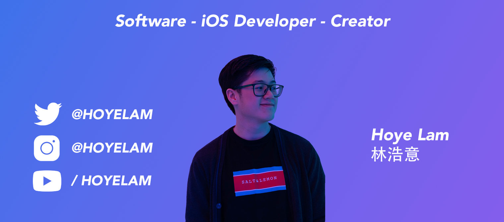

---

    •
  <a href="https://hoyelam.icom">Blog</a> •
  <a href="https://twitter.com/intent/follow?screen_name=hoyelam&tw_p=followbutton">Twitter</a>

---

## 👋 Hey there! I’m Hoye Lam 

### 👨🏻‍💻 About Me
I’m a software developer that is primarily focussed on iOS development for now. I’ve worked for several companies/startups like Somnox (world’s first sleep robot) and write a [daily-ish blog](https://hoyelam.com). I’ve also launched four side-products during my full-time work with the most recent one Growrilla - the app to count anything and everything.

- ⚙️ 4+ years of experience in professional software engineering.
- 📱 4+ years of experience in iOS development.
- 👔 1 year of experience in leading/managing teams and projects
- 📡 1 year of experience in back-end development.
- 🤖 1 year of experience in Android development.
- 🏔️ Experience in industries: Sleep Tech, Healthcare, Education, Catering
- 💬 Feel free to reach out to me for pro bono consulting and volunteering, or just for some interesting discussion.
- ✉️ You can shoot me an email at hoyelam@pm.me! I’ll try to respond as soon as I can.
- 📄 Have a look at my [portfolio](https://hoyelam.com/portfolio/) for more projects I’ve done. I’m open to feedback and suggestions!

### 🛠 Tech Stack
&nbsp;
&nbsp;

### Fun Trivia Facts
- 💬 Can speak Dutch, English, Cantonese and some Mandarin
* 🎮 Like esports primarily CS:GO and League of Legends
* 🎵 Like to listen to music especially Hip-Hop
* 🏡 Primarily lived in the Netherlands but also Hong Kong
* ✈️ Travelled to U.S., China (Shenzhen), Hong Kong, Korea, Thailand, Malaysia, Iceland, Belgium, France, Germany, U.K., and Italy
* 🦁 Performed in seven different Chinese New Year events during 2019 and 2020 for lion- and dragon dances
* 💻 Started learning iOS development on a (very bad) Windows Laptop using Virtual Machine
* 🎮 Played League of Legends semi-professionally in 2013-2014 (Diamond 1, 80~ lp)
* 🔫 Played Overwatch semi-professionally in 2018 (Overwatch Open Division)
* 🧨 Operate a small gaming community called Insanctuary
* 🥋 Practiced Karate till 14 years old
